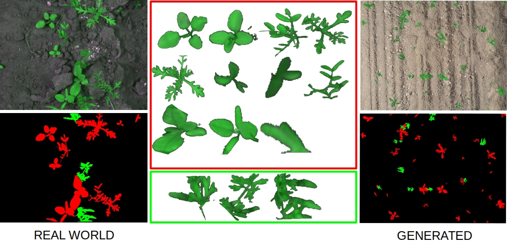
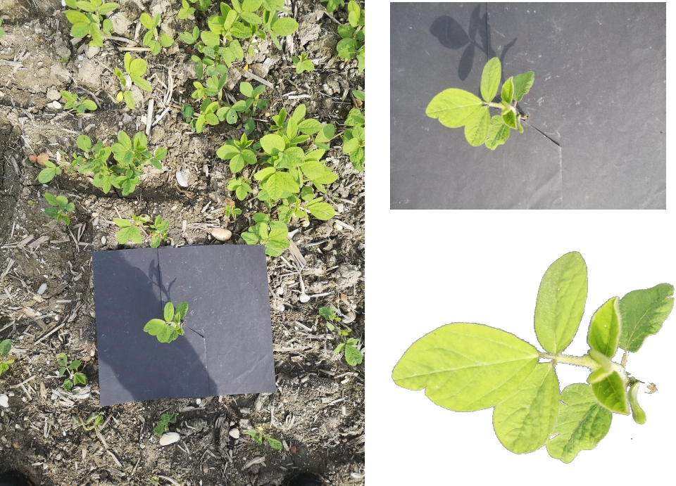

# DigitalFieldTwin
This repository contains the source code of my master thesis at the University of Vienna with the title Digital Field Twin. The goal is to create and extend training data for a weed detection algorithm. 
Single images of plants are inserted into ground images. The result is a collection of images and annotation masks of a parameterized field, called Digital Field Twin.
Two ways to populate the database with single plants were implemented: 
1. Data Collection Workflow: A process that supports a farmer in collecting and annotating data using a smartphone in the field.  
2. Split Dataset: Annotation masks or information on the polygons used for edging the plants are used to split up a dataset into sinle plants.

## Separation of Annotated Dataset
The following image illustrates the pipeline to split and recombine a dataset. The real world annotated dataset is separated based on the annotation mask. The images and some metadata (e.g. size, age and species) are stored in a database. The cropped plant images are loaded from the database based on age, species or notes. The single plant images are then inserted into a ground image and combined to a "Digital Field Twin".

Source of the real world dataset: [A Crop/Weed Field Image Dataset](https://github.com/cwfid/dataset)

## Data Collection Workflow
The Data Collection Workflow instructs the user via a smartphone how to collect and annotate the data in the field. The background is covered by a black paper to make it easier for an algorithm to automatically cut out a single plant.

