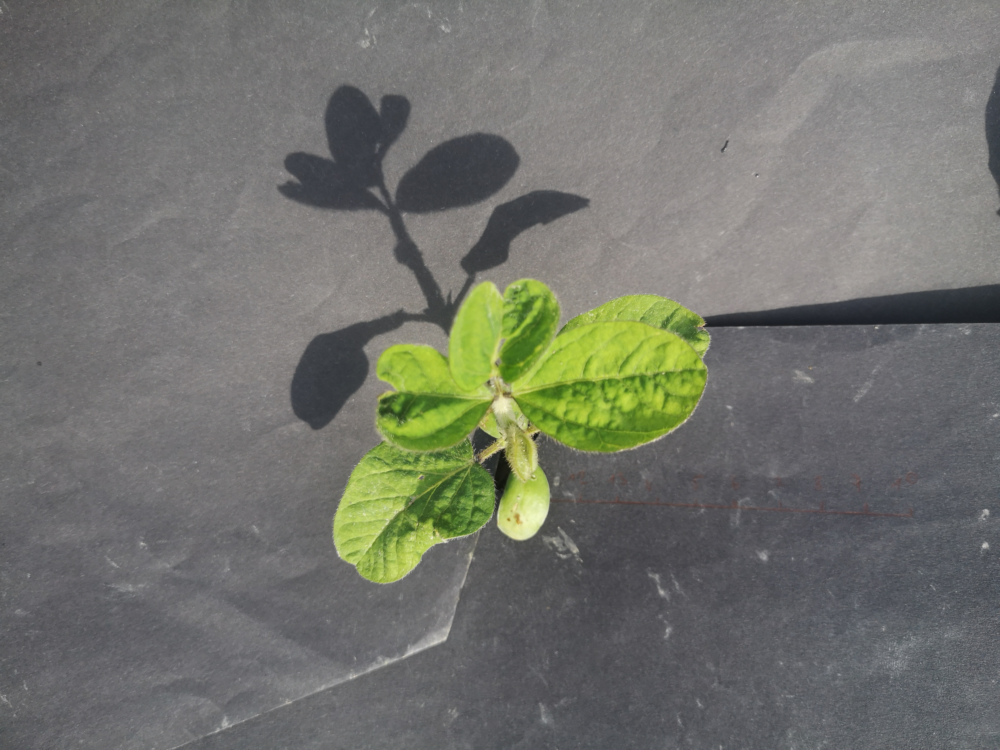
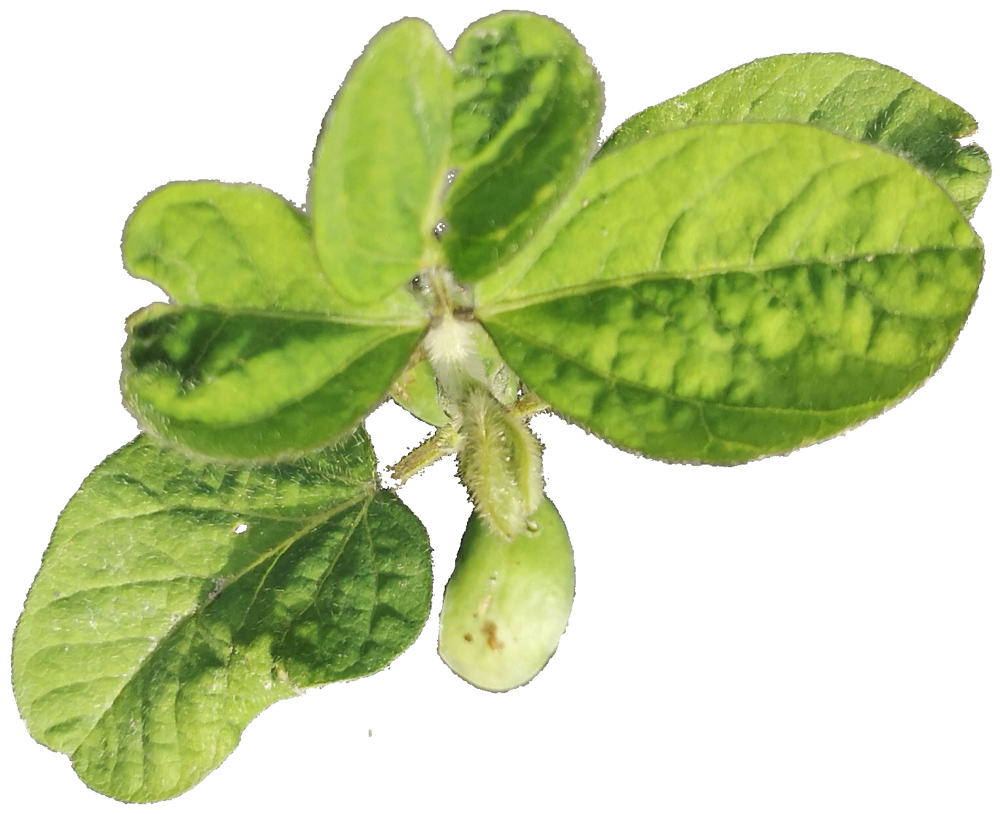
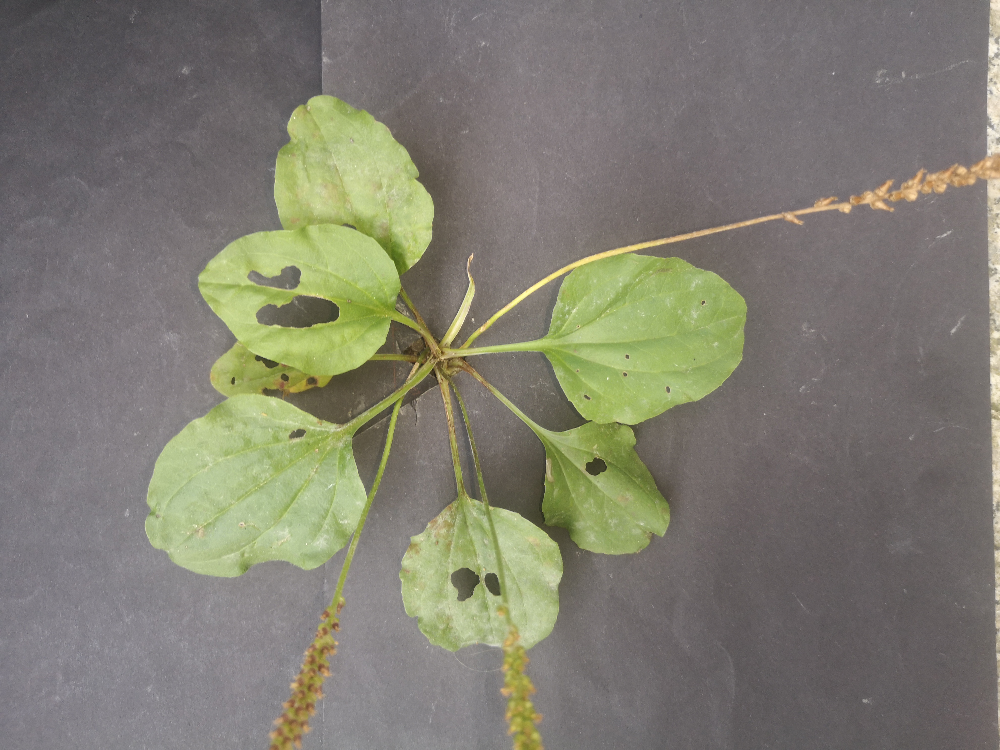

# Data Collection Workflow
The Data Collection Workflow enables farmers to collect new images and annotate them in the field. The process is designed in a way so that it can be executed in a web browser on a smartphone. The process is implemented in the process execution engine [CPEE](https://cpee.org/). The workflow engine orchestrates the teamwork of computers running the automatic tasks
and humans doing the manual tasks. The following table lists the tasks which are part of the Data Collection Workflow with a description.
The services have a REST interface which is used to coordinate the services and transfer data between the services.

Name                   | Description
Show Instructions      | The first step is to instruct the user what to do. The scene has to be prepared in a manner that only one plant is in the image and the background is black. The ground and other plants are covered with black paper.
Take Image             | The second task is to take an image showing the black background and the plant.
Crop Image             | Trigger the cropping algorithm and wait till it has finished.
Show Cropped Image     | Show the cropped image to the user. The user gives feedback about the cropped image. If the cropped image of the plant is bad (e.g. a lot of background pixels are present) the user can start at Take Image again.
Input Plant Attributes | Additional information about the plant is collected: age of plant, species, width in cm and notes.
Store to Database      | The ID of the collected plant image and the information about the plant is send to the database service.

## Example
The images were taken with a HUWEI P20.
 <table>
   <tr>
    <td></td>
    <td></td>
   </tr> 
  </tr>
  <tr>
    <td></td>
    <td></td>
   </tr> 
  </tr>
</table>
