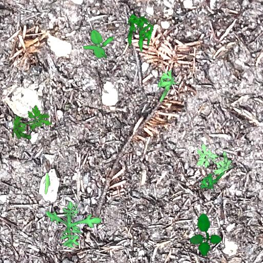
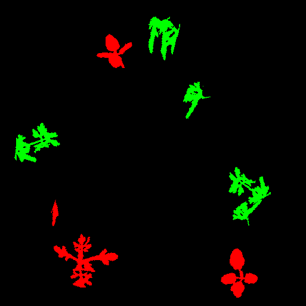
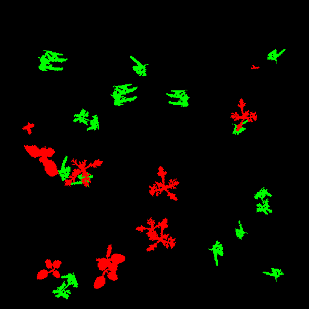

# Digital Field Twin Generator
 The Digital Field Twin (DFT) generator loads ground and plant images from the database based on paramters like age, notes and species. The images are rotated, rescaled, changed in brightness and inserted into a ground image. The corresponding annotation mask is generated in parallel. 
 
 ## Example of an Image of a Carrot DFT
 The plant images of weeds and carrots are from [A Crop/Weed Field Image Dataset](https://github.com/cwfid/dataset). The [test DFT](./test/) is created with 3 carrot, 11 weed and 6 ground images (weeds and carrots are are cut out of [this image](https://github.com/cwfid/dataset/blob/master/images/060_image.png)). 
 <table>
   <tr>
    <td></td>
    <td></td>
   </tr> 
  </tr>
  <tr>
    <td></td>
    <td></td>
   </tr> 
  </tr>
</table>

## Test
Run `ruby dig_field.rb --config=test/test_config.yaml` to create another DFT.

