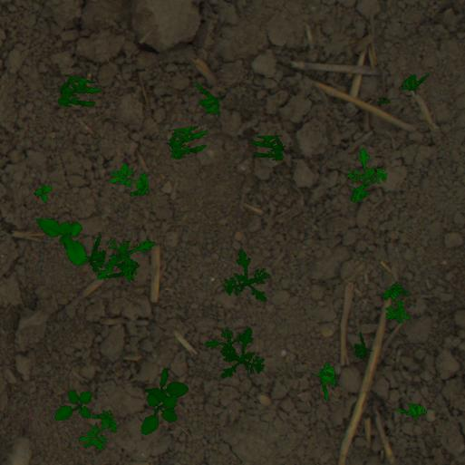

# Digital Field Twin Generator
 The Digital Field Twin (DFT) generator loads ground and plant images from the database based on paramters like age, notes and species. The images are rotated, rescaled, changed in brightness and inserted into a gorund image. The corresponding annotation mask is generated in parallel. 
 
 ## Example of an Image of a Carrot DFT
 
 <table>
  <tr>
    <td> </td>

    <td></td>
   </tr> 
  </tr>
</table>

